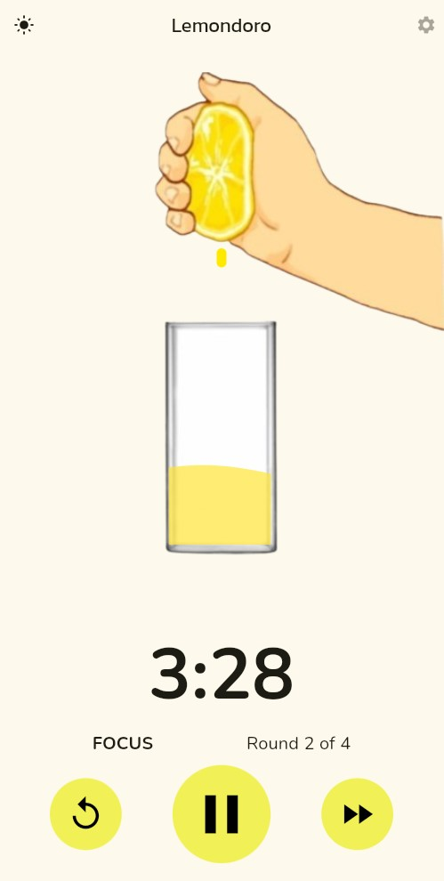
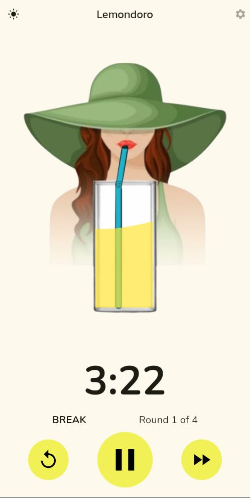
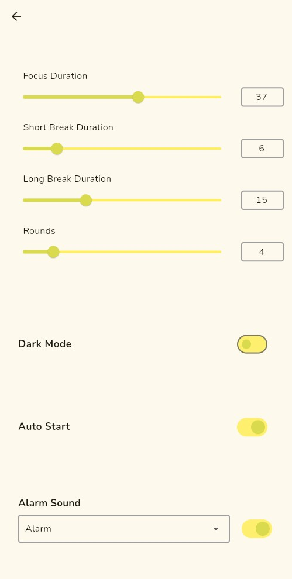

  
  
  

# Lemondoro 🍋⏱️  
Lemondoro is a simple Pomodoro timer app built with Flutter that makes productivity fun and interactive.

---

## Features  
- 🍋 Squeeze lemons to make lemonade during focus sessions  
- 🧃 Watch a character drink the lemonade during breaks  
- ⏱️ Customize focus and break intervals  
- 🌙 Switch to dark mode for late-night use  

---

## How It Works  
1. Start a focus session and squeeze lemons to make lemonade.  
2. Take a break while the character drinks the lemonade.  
3. Repeat for better focus and reduced burnout.  

---

## How to Run  

### Prerequisites  
Ensure you have the following installed:  
- **Flutter SDK**: [Install Flutter](https://flutter.dev/docs/get-started/install)  
- **Android Studio or VS Code**: For development and running the app.  
- **An emulator or physical device**: To test the app.  

### Steps to Run  
1. **Clone this repository**:  
   `git clone https://github.com/topaz174/lemondoro.git`

2. **Navigate to the project folder**:  
   `cd lemondoro`

3. **Install dependencies**:  
   `flutter pub get`

4. **Run the app**:  
   `flutter run`

### Optional: Build an APK or App Bundle  
- To build an APK:  
   `flutter build apk`
- To build an AAB (for Google Play Store):  
   `flutter build appbundle`

---

## Why Lemondoro?  
Lemondoro makes productivity fun by turning a simple timer into an interactive experience.
